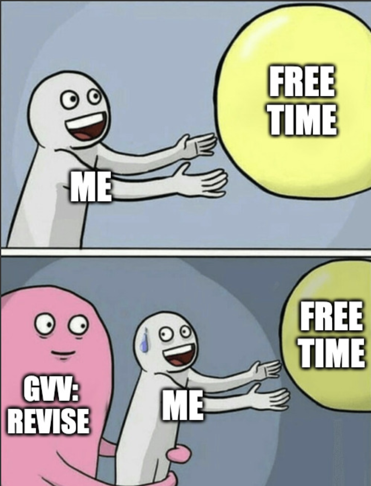

# $\color{Cerulean}{\text{EE1030: Course Wiki}}$
Hi there! 
Welcome to IITH. This course marks the beginning of a unique experience at IITH. For better or for worse, this course is the only one of this kind. 


> [!CAUTION]
>This course will be very intensive. (Contrary to other courses) If you want a good grade, you must put in much more time and effort.
>Be inquisitive. Ask questions. Doesn't matter if they are "bad". Also, answer in class. It doesn't matter if the answer is wrong. You'll understand the reason later.

## $\color{Cerulean}{\text{Course Content}}$

You can expect to learn some amount of Matrix theory (sufficient for further courses/ study in EE in general)
Besides the actual contents of the course, you will also learn 
* Python as a tool for scientific computing (making "cool" graphs, solving problems and stuff) 
* GitHub as a platform
* $\LaTeX{}$ :Forget messy handwriting,
this is how real engineers write their reports (and it looks fancy too).


## $\color{Cerulean}{\text{Classes}}$
The classes will be on a weekday (Wednesday mostly) from 5:30 PM to 8:30 PM. 

The classes will consist of "quizzes" which are essentially sir giving you questions on the board, and you having to solve them using whatever online tools, and discussing with others. Every day, sir will give a question, you have to answer it in a given time (5-15 min) and submit it, at which point, sir will ask for volunteers to solve the question on the board. If no one volunteers, he will choose. (Even if you don't know the answer, dw).

You also might have code assignments in the class. Sir will ask you to do something related to a previous question, and you will need to write code (or prompt an AI to write code). The submissions will be handled by the discord channels `#send-codes` or `#send-output`, and the TAs will evaluate the submissions received until the time limit.


## $\color{Cerulean}{\text{Course Work}}$
The work you are expected to do will mainly consist of the following
* "Online Assignments": These are the questions given to you in Google Sheets. Further instructions [here](#colorceruleantextworking-on-online-assignments)
* "Hardware Assignments": You MAY have to build some circuit/project in the lab as part of your evaluation. More information [here](#colorceruleantextworking-on-hardware-assignments)
* "Quizzes":  Discussed above


## $\color{Cerulean}{\text{Working on Online Assignments}}$

### $\color{cyan}{\text{Getting the Question}}$
You will be assigned questions in Google Sheets, which you have to type out in $\LaTeX$

### $\color{cyan}{\text{Decrypting the question }}$
The question you are assigned may be of the form

 `(Source) - (year/chapter_number/question_number)`
 or 
 `(Chapter) - (Section) - (Subsection) - (Question)`

For example, `NCERT - 11/5/26` indicates question 26, from the 5th chapter in the year 11 from the NCERT Physics Textbook.
And 1 /A /A(1-10) may indicate the first 10 questions of Subsection A, in Section A in Chapter 1 of the Collection.
Another format may be 

`(EXAM NAME / YEAR / SHIFT / QNO)` for GATE / JEE questions

### $\color{cyan}{\text{Solving the question}}$
Study the reference document given in [Course-Setup](https://github.com/Mihir-Divyansh/Course-Setup/blob/a12b604a79e0056068c94088a1f10e1cc1dfe458/LaTeX/Example%20Assignment/main.tex)
Your approach to the question determines how things will go. Try to apply any and all concepts you have discovered in class, to the question. If you do not get an approach, do ask sir or any of the TAs. You will have to redo the assignments multiple times, with small changes each time, until sir/your TA is satisfied with your pdf. 


Students during GVV sir's course be like



### $\color{cyan}{\text{Storing solutions on GitHub }}$

If you don't know what 'git' is, here is a brief description. 

'GIT' - Global Information Tracker is a "version control system."
Git is like having a magic notebook for your code. This notebook keeps track of every edit you make, allowing you to rewind if needed and see how your code is transformed. It also lets you work with others on the same code without conflicts, so it's like having a tool that keeps your code safe and organized!

GitHub is like a cloud version of GIT and allows you to store and share your code with others on it.

How is it useful to us? 

Well, you see, Sir keeps track of the questions that the students solve, by creating a book containing all the accepted solutions. It is easier with GitHub

If you completed the course setup, you already have a GitHub account and a Repository for this course. Since your questions will be of multiple types, it will benefit you if you create a folder for each type, as you get a question pertaining to it.
* NCERT
* GATE
* JEE

You can then label your assignments in any manner. 
Your assignment folder must contain the following 
* A Folder named 'tables' to store the table you have in your document
* A Folder named 'figs' if you have any figures in your document
* A Folder named 'codes' to store C / Python codes.

Ideally, here's how your Assignment Folder should look.


Other than the Folders, The only file you are responsible for maintaining is main.tex. The rest are a by-product of compiling the TeX file.

### $\color{cyan}{\text{Submitting the solutions}}$
When you are done with your work, you need to send the link of your repo ('Copy Permalink' in the 3 dots) or (Ctrl/Cmd + Shift + ,) to sir in the channel labelled `your_roll_number - your_name`. Sir will have one of 2 responses
* Make some changes and revise
* Commit to repo

The first response is self-explanatory. The second one invokes the following procedure.

### $\color{cyan}{\text{Commiting your solution to repo}}$
When sir tells you to commit a solution to repo, you need to 
1. Fork the repository for the submission
2. Ensure the following lines in your code.
  ```latex
    \iffalse
    . %Preamble here
    .
    .
    \fi
    \author{ "Roll number / Name"} 
    \chapter{"Name of chapter"}
    \question %Before the beginning of the question
    \solution %Before the solution after the question
  ```

3. Make sure you have at least a figure and a table in your solution.
4. To autogenerate the necessary files, run 
  ```bash
    python3 latexgen.py
  ```
5. Then run 
  ```bash
    pdflatex main.tex 
    pdflatex main.tex
  ```
 (yes, twice)
 
6. This will generate the pdf of the book. 
7. Open a pull request for sir's repo, with the commit message
    > "Q.no in Book - Q.no wrt source, Name, Roll number"

$$\color{yellow}{\text{This is the process for completing online assignments.}}$$


## $\color{Cerulean}{\text{Working on Hardware Assignments}}$
* The components and the circuit schematic will be provided (mostly). There is a chance that sir may ask you to design your own circuit. 
* There will be a viva-voce after the circuit building is done.
* You must maintain a handwritten Lab Report.

You will be evaluated on the demo of the circuit, the understanding you show during the viva, and your lab report.

> The lab work may be in pairs or in groups of 3 / 4. The lab reports must be written individually, the students will be questioned individually.
 
> [!TIP] 
> Experiment a lot with the circuit given. Try to improve it. Try to make changes and see what happens. Measure every possible voltage or current you can. Document the process.
